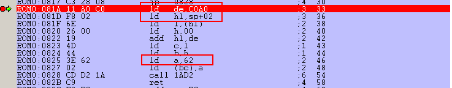

# [WARGAME NDH 2017] Write-Up - Reverse: help_me (250 points)

## Description

Le challenge contenait un seul fichier « wargames.gb », vraisemblablement une
ROM gameboy:

```
> file wargames.gb
wargames.gb: Game Boy ROM image: "TEST2" (Rev.01) [ROM ONLY], ROM: 256Kbit
```

Le challenge précise que le flag est le mot de passe à trouver avec un préfixe
qui est donné.


## Démarrage de la ROM et du debug

Je ne connais rien en émulation et debug de ROM gameboy, je cherche donc
un outil. Un critère : il doit tourner sur Linux, car je suis venu les
mains dans les poches, sans même une VM Windows.

Je trouve plusieurs outils, mais bgb se démarque. Il a un débogueur et
fonctionne avec wine sous Linux. Pour lancer l'émulation, rien de plus simple:

```
> wine bgb.exe wargames.gb
```

On tombe sur une petite animation avec trois écrans qui se succèdent:


Le mot de passe est de 10 caractères. Toutes les valeurs ne sont pas possibles.
En tapant au clavier, je note que mes touches "a" et "s" sont acceptées. Bon.
Au 10ème caractère entré, un écran indique « fail » après une nouvelle
animation:


Avec l'aide de la doc de l'émulateur, je démarre le mode debug en appuyant sur
echap:


Je ne maitrise absolument pas le débogueur ni l'architecture du Zilog Z80 de la
gameboy, mais ce sera l'occasion de découvrir.


## Par où commencer ?

Le problème est de savoir par où commencer le debug. Je parcours rapidement le
contenu de la mémoire et les options du debuggueur, puis je pose comme une brute
des points d'arrêt au hasard. Évidemment, c'est improductif: il s'arrête
dans les routines d'affichage tout le temps.

Je ne sais pas comment afficher une sorte de pile d'appel et je perds mon temps à
remonter les fonctions à chaque return. Je sens bien que je m'y prends mal. Au
moins j'apprends à utiliser le débogueur. Je découvre que l'on peut activer un
mode logging qui colore en gris le code qui a été ou qui va être exécuté. C'est
pratique pour identifier les limites d'une fonction.


## Trouver la lecture des I/O

Je me mets à la recherche de la routine qui récupère l'appuie des touches.
Je trouve des bouts de code où il est question du joystick. En fouillant la
doc de la gameboyje tombe sur une info importante ici
http://www.emulatronia.com/doctec/consolas/gameboy/gameboy.txt :

```
 The registers:

------------------------------------------------------------------------------
   Address  - $FF00
   Name     - P1
   Contents - Register for reading joy pad info.    (R/W)

           Bit 7 - Not used
           Bit 6 - Not used
           Bit 5 - P15 out port
           Bit 4 - P14 out port
           Bit 3 - P13 in port
           Bit 2 - P12 in port
           Bit 1 - P11 in port
           Bit 0 - P10 in port

         This is a very strange way of reading joypad info.
         There are only 8 possible button/switches on the Game Boy.
         A, B, Select, Start, Up, Down, Left, Right.
         Why they made their joypad registers in this way I'll never know.
         They could have used all 8 bits and you just read which one is on.

         This is the matrix layout for register $FF00:


           P14                P15
            |                  |
--P10-------O-Right------------O-A---------
            |                  |
--P11-------O-Left-------------O-B---------
            |                  |
--P12-------O-Up---------------O-Select----
            |                  |
--P13-------O-Down-------------O-Start-----
            |                  |
```
En 0xFF00, il y a le registre avec la valeur des touches. J'examine la mémoire à
cette adresse:


Les valeurs bougent beaucoup. Probablement les interruptions pour l'affichage,
les timers, etc. En appuyant sur les touches "a" et "s", je m'aperçois que le
registre $FF00 prend respectivement les valeurs 0xD et 0xE, ce qui correspond au
passage à zéro d'un bit (0xF quand je lâche tout).

Je décide de mettre un point d'arrêt conditionnel sur pour m'arrêter sur
l'écriture de la valeur 0xD. Je me retrouve dans ce bout de code:


Le code est assez simple. Il extrait la touche appuyée du registre et pour le
mettre dans le registre **a**. Le problème est que lorsque le break se déclenche,
je lâche la touche et n'arrive pas à lire la valeur de la touche. Je mets
un point d'arrêt à la sortie de la boucle et enlève mon point d'arrêt
conditionnel.

# Que fait-il du password entré ?

J'arrive à l'adresse 0x076D où je tombe sur un nouveau code intéressant:


Il compare la valeur du registre **a** aux valeurs possibles et jump vers le
code à exécuter. Par exemple, quand j'appuie sur la touche "a", le registre **a**
a la valeur 0x20 et il jump sur 0x081A:



Il charge l'adresse 0xCAA0 et y ajoute un offset (c'est un tableau). Il stocke
la valeur 0x62 à l'adresse calculée. Un rapide coup d'oeil aux valeurs stockées
dans le tableau montre qu'il contient le password tapé.


0x62 = 'a' en ascii, ce qui correspond au bouton A de la gameboy. Quand j'appuie
sur 's', il stocke en réalite la valeur du bouton B en ascii (0x62 = 'b').

# Reverse du password

Il ne me reste plus qu'à trouver la vérification du mot de passe stocké. Pour
cela, je pose un point d'arrêt sur la lecture de l'adresse 0xCAA0.

Et...ça ne marche pas ! Mais en faisant la même chose à l'adresse 0xCAA1, ça
marche. Le password n'est visiblement pas vérifié dans l'ordre...

Preuve que l'on s'approche du but, il vérifie rapidement si le caractère n°2
contient 0x72:


J'ai mon premier caractère ! Je tape sur toutes les touches de mon clavier et
j'arrive enfin à trouver celle qui me donne 0x72. Je peux poursuivre mon
reverse.

Mon problème à ce moment là, c'est qu'il est déjà tard et que l'épreuve se
termine bientôt. Je commence à aller trop vite dans mon debug pour comprendre
le code. En 0x0835, je tombe sur un gros switch que je ne prends pas le temps
d'analyser en pensant gagner du temps...


J'apprends que l'épreuve se termine 1h plus tard que ce que je croyais. Après
une pause, je reprends l'analyse calmement.

Je comprends enfin que le switch regarde la position du caractère à tester
(rappellons qu'il ne les teste pas dans l'ordre). Je décide alors de suivre
step par step chaque jump qui suit la comparaison pour trouver les caractères
attendus. Les tests ne sont pas trop compliqués, car il n'y a aucun calcul. Il
faut juste suivre les branchements, parfois un peu différent (dans la capture,
on voir que le 6 n'existe pas).

## Fin de l'épreuve

J'ai 9 caractères sur 10 quand l'épreuve se termine. Assez dégouté à ce moment là...
Dans le train du retour, je relance tout et en 10 minutes, j'obtiens un password
valide:
**lrbraabbud**.


